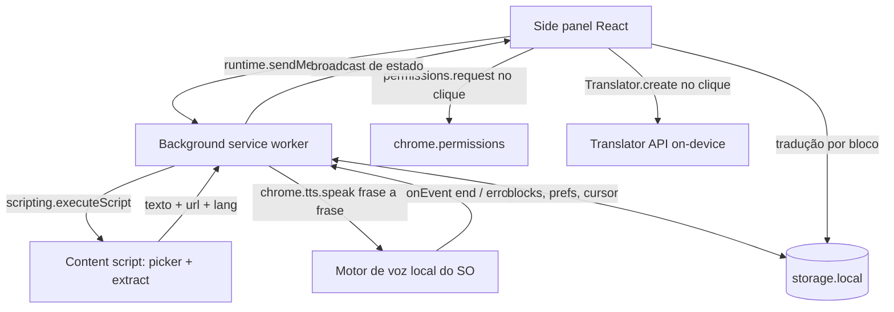

# TTS Reader — Design

**Spec**: `.specs/features/tts-reader/spec.md`
**Status**: Draft

---

## Architecture Overview

Três processos, um estado. O painel é só apresentação e comandos; quem fala e quem
sabe onde está a leitura é o background; o content script só extrai texto e some.
O estado de verdade vive em `storage.local` porque o service worker MV3 é
encerrado em torno de 30 segundos de ociosidade e qualquer variável em memória é
perdida.



Duas fronteiras merecem atenção porque são onde o navegador não coopera:

1. **Gesto do usuário.** `permissions.request` e `Translator.create` com download
   exigem ativação do usuário na mesma tarefa do clique. Ambos são disparados no
   painel, no handler do evento, sem `await` antes.
2. **Ciclo de vida do service worker.** `chrome.tts` continua falando mesmo com o
   worker adormecido, e o evento `end` o reacorda. Por isso o cursor é gravado
   antes de cada frase, e o worker reconstrói tudo de `storage.local` ao acordar.

---

## Code Reuse Analysis

Projeto greenfield: não há código a reusar. O que substitui código próprio:

| Recurso | Origem | Como usamos |
| ------- | ------ | ----------- |
| Geração de manifest, entrypoints, HMR, `zip` | WXT 0.21 | Dispensa `manifest.json` manual e script de empacotamento |
| `storage` tipado | `wxt/storage` | Dispensa wrapper próprio sobre `chrome.storage` |
| Segmentação de frases | `Intl.Segmenter` (nativo) | Dispensa regex de pontuação e biblioteca de NLP |
| Síntese de voz | `chrome.tts` (nativo) | Dispensa serviço externo; sobrevive ao painel fechado |
| Tradução | `Translator` API (nativa, Chrome 138+) | Dispensa API paga e chave |
| Nome de idioma na UI | `Intl.DisplayNames` (nativo) | Dispensa tabela de idiomas |
| Transição entre abas | View Transitions (CSS nativo) | Dispensa biblioteca de animação |

### Integration Points

| Sistema | Integração |
| ------- | ---------- |
| Aba do usuário | `scripting.executeScript` sob demanda, nunca content script declarado |
| Motor de voz do SO | `chrome.tts`, filtrado por `remote: false` |
| Modelo de tradução on-device | `Translator.availability` / `create` / `translate` |

---

## Components

### `lib/types.ts`

- **Purpose**: Modelo de dados compartilhado entre painel, background e content script.
- **Location**: `lib/types.ts`
- **Interfaces**: `Block`, `Paragraph`, `Sentence`, `Cursor`, `Prefs`, `PlaybackState`.
- **Dependencies**: nenhuma.

### `lib/segment.ts`

- **Purpose**: Transformar texto bruto em parágrafos e frases com ids estáveis.
- **Location**: `lib/segment.ts`
- **Interfaces**:
  - `segmentBlock(text: string, lang: string, blockId: string): Paragraph[]`
  - `chunkSentence(text: string, max: number): string[]`
- **Dependencies**: `Intl.Segmenter`, `lib/types.ts`.

### `lib/storage.ts`

- **Purpose**: Único ponto de leitura e escrita de `blocks`, `prefs` e `cursor`.
- **Location**: `lib/storage.ts`
- **Interfaces**:
  - `getBlocks(): Promise<Block[]>` / `setBlocks(b: Block[]): Promise<void>`
  - `appendBlock(b: Block): Promise<{ ok: true } | { ok: false; reason: 'full' | 'quota' }>`
  - `removeBlock(id: string)` / `clearBlocks()`
  - `getPrefs()` / `setPrefs(p: Partial<Prefs>)`
  - `getCursor()` / `setCursor(c: Cursor)`
- **Dependencies**: `wxt/storage`.

### `lib/voices.ts`

- **Purpose**: Listar vozes utilizáveis e escolher a voz de um idioma.
- **Location**: `lib/voices.ts`
- **Interfaces**:
  - `listLocalVoices(): Promise<Voice[]>` — só `remote: false`
  - `pickVoice(voices: Voice[], lang: string, manual: Record<string,string>): Voice | null`
- **Dependencies**: `chrome.tts.getVoices`.

### `lib/cursor.ts`

- **Purpose**: Aritmética pura do cursor sobre o buffer — sem I/O.
- **Location**: `lib/cursor.ts`
- **Interfaces**:
  - `nextCursor(blocks: Block[], c: Cursor): Cursor | null`
  - `firstCursor(blocks: Block[]): Cursor | null`
  - `sentenceAt(blocks: Block[], c: Cursor): Sentence | null`
  - `reconcile(blocks: Block[], c: Cursor): Cursor | null` — reposiciona quando o bloco do cursor sumiu
- **Dependencies**: `lib/types.ts`.

### `lib/messages.ts`

- **Purpose**: Contrato tipado painel ↔ background.
- **Location**: `lib/messages.ts`
- **Interfaces**: `Command = {type:'play'|'pause'|'stop'|'seek'|'setRate'|'setVoice'|'capture'|'state'}`, `sendCommand`, `onCommand`, `broadcastState`.
- **Dependencies**: `chrome.runtime`.

### `entrypoints/background.ts`

- **Purpose**: Fila de fala, dono do estado de reprodução, abertura do painel.
- **Location**: `entrypoints/background.ts`
- **Interfaces**: handlers de `Command`; `chrome.tts.onEvent`; `sidePanel.setPanelBehavior({ openPanelOnActionClick: true })`.
- **Dependencies**: `lib/storage.ts`, `lib/cursor.ts`, `lib/segment.ts`, `lib/messages.ts`.

### `lib/extract.ts`

- **Purpose**: Regras puras de extração de texto de um nó ou da seleção.
- **Location**: `lib/extract.ts`
- **Interfaces**:
  - `extractFromSelection(doc: Document): string`
  - `extractFromElement(el: Element): string`
  - `pageLang(doc: Document): string`
- **Dependencies**: DOM.

### `entrypoints/content.ts`

- **Purpose**: Overlay do picker; injetado sob demanda, não declarado no manifest.
- **Location**: `entrypoints/content.ts`
- **Interfaces**: ativa contorno no `mouseover`, captura no `click`, cancela no `Escape`, devolve o resultado por mensagem.
- **Dependencies**: `lib/extract.ts`, `lib/messages.ts`.

### `lib/capture.ts`

- **Purpose**: Decidir se é preciso pedir permissão e orquestrar a injeção.
- **Location**: `lib/capture.ts`
- **Interfaces**:
  - `needsPermission(url: string, granted: string[]): boolean`
  - `isCapturable(url: string): boolean` — falso para `chrome://`, Web Store, `file://` sem acesso
  - `requestAndCapture(tabId: number, mode: 'selection' | 'picker')`
- **Dependencies**: `chrome.permissions`, `chrome.scripting`.

### `lib/translate.ts`

- **Purpose**: Envoltório da Translator API com cache por bloco.
- **Location**: `lib/translate.ts`
- **Interfaces**:
  - `translationSupport(): 'ok' | 'unsupported'`
  - `availability(source: string, target: string): Promise<Availability>`
  - `translateBlock(block: Block, target: string, onProgress: (n:number)=>void): Promise<string>`
  - `isStale(block: Block): boolean`
- **Dependencies**: `Translator` global.

### Componentes React

| Componente | Local | Papel |
| ---------- | ----- | ----- |
| `App.tsx` | `entrypoints/sidepanel/App.tsx` | Assina o estado do background, distribui props |
| `CaptureBar.tsx` | `components/CaptureBar.tsx` | Capturar seleção, modo picker, Limpar |
| `BlockList.tsx` | `components/BlockList.tsx` | Blocos, frases, destaque, auto-scroll, remover, editar |
| `Controls.tsx` | `components/Controls.tsx` | Play/pause/stop, velocidade, voz, estados de erro |
| `TranslatePanel.tsx` | `components/TranslatePanel.tsx` | Abas Original/Tradução, idioma destino, progresso |

---

## Data Models

```typescript
interface Sentence { id: string; text: string }
interface Paragraph { id: string; sentences: Sentence[] }

interface Block {
  id: string                  // crypto.randomUUID(), estável enquanto o bloco existir
  sourceUrl: string
  sourceTitle: string
  lang: string                // documentElement.lang ou navigator.language
  text: string                // texto bruto, fonte da verdade da edição
  paragraphs: Paragraph[]     // derivado de text por segmentBlock()
  translation?: {
    target: string
    text: string
    paragraphs: Paragraph[]
    sourceTextHash: string    // compara com text para detectar tradução desatualizada
  }
  createdAt: number
}

interface Cursor { blockId: string; paraIndex: number; sentIndex: number }

interface Prefs {
  rate: number                       // 0.5 .. 3.0, padrão 1.0
  targetLang: string                 // padrão navigator.language
  voiceByLang: Record<string, string> // escolha manual por idioma
  activeTab: 'original' | 'translation'
}

interface PlaybackState {
  playing: boolean
  cursor: Cursor | null
  error: string | null
}
```

**Relationships**: `Cursor` referencia `Block.id` e índices dentro dos `paragraphs`
daquele bloco na aba ativa. `reconcile()` é chamado sempre que `blocks` muda.

---

## Error Handling Strategy

| Cenário | Tratamento | Impacto no usuário |
| ------- | ---------- | ------------------ |
| Nenhuma voz local | `listLocalVoices()` vazia desabilita reprodução | "Nenhuma voz local instalada neste sistema" |
| Sem voz para o idioma | `pickVoice` retorna null | "Sem voz instalada para [idioma]", play travado |
| `chrome.tts` emite `error` | Para a fila, mantém o cursor, grava `error` no estado | Mensagem no painel, leitura retomável |
| Permissão de host negada | `requestAndCapture` retorna sem escrever no buffer | "Sem acesso a este site" |
| Página não capturável | `isCapturable` falso antes de qualquer injeção | "Não é possível capturar desta página" |
| Injeção falha (iframe/shadow fechado) | Erro do `executeScript` capturado | "Conteúdo inacessível nesta região da página" |
| Buffer acima de 500k caracteres | `appendBlock` retorna `{ok:false, reason:'full'}` | "Buffer cheio — limpe ou remova blocos" |
| Cota de `storage.local` | Escrita falha, buffer anterior preservado | "Armazenamento cheio" |
| Translator ausente | `translationSupport()` = `unsupported` | Botão desabilitado com motivo |
| Par de idiomas indisponível | `availability` = `unavailable` | "Par de idiomas não disponível" |
| Falha de tradução ou download | Exceção capturada, original intacto | Mensagem no painel |
| Frase acima de 32k caracteres | `chunkSentence` parte antes de falar | Nenhum |

---

## Risks & Concerns

| Concern | Location | Impact | Mitigation |
| ------- | -------- | ------ | ---------- |
| `activeTab` não é concedido por interação no side panel | `lib/capture.ts` | Capturar pelo painel falha em todo site novo | `optional_host_permissions: ["<all_urls>"]` com `permissions.request` no próprio clique; `activeTab` continua cobrindo a captura iniciada pelo ícone |
| Vozes padrão do Chrome são remotas (`remote: true`) e enviam o texto ao servidor do Google | `lib/voices.ts` | Quebra a premissa on-device sem o usuário perceber | Filtrar `remote: false` e tratar lista vazia como estado de primeira classe |
| Service worker encerrado no meio da fila | `entrypoints/background.ts` | Leitura retoma do ponto errado ou não retoma | Cursor gravado antes de cada frase; estado reconstruído de `storage.local` no `onEvent` |
| Edição durante a fala invalida índices | `components/BlockList.tsx` | Volta a ler trecho errado, caret pulando | Edição só com leitura parada/pausada; `contenteditable` não controlado; `reconcile()` após qualquer mudança em `blocks` |
| Picker quebra em SPA que remonta DOM, virtualização, shadow DOM | `entrypoints/content.ts` | Captura vazia ou errada | Falha explícita com mensagem; seleção nativa é o caminho alternativo sempre disponível |
| Gesto do usuário perdido por `await` antes de `Translator.create` | `lib/translate.ts` | Download de dezenas de MB rejeitado | `availability` consultada antes do clique; `create` chamado direto no handler |
| Texto misto (artigo em PT com citação em inglês) | `lib/voices.ts` | Voz errada em parte do texto | Idioma por bloco, não por buffer; select de idioma editável por bloco |

---

## Tech Decisions

| Decisão | Escolha | Racional |
| ------- | ------- | -------- |
| Framework de extensão | WXT 0.21 | Gera manifest, entrypoints e `zip`; HMR no content script |
| Superfície principal | Side panel | O fluxo é navegar e voltar; popup fecha ao clicar na página |
| Onde a voz toca | Background com `chrome.tts` | Sobrevive ao painel fechado; `speechSynthesis` não existe em service worker MV3 |
| Unidade de fala | Frase (`Intl.Segmenter`) | Contorna limite de tamanho do motor, dá destaque útil e ponto de retomada |
| Âncora do cursor | Id de bloco + índices | Sobrevive a remoção e edição de outros blocos |
| Estado compartilhado | `storage.local` | Service worker MV3 perde memória em ~30s |
| Permissões | `activeTab` + `optional_host_permissions` | Instalação sem aviso amplo; acesso pedido quando o painel precisa |
| Testes | Vitest apenas sobre `lib/` | Lógica pura testável; telas verificadas manualmente |
| Alvo v1 | Chromium | Firefox exige segundo caminho de áudio e não tem Translator API |
